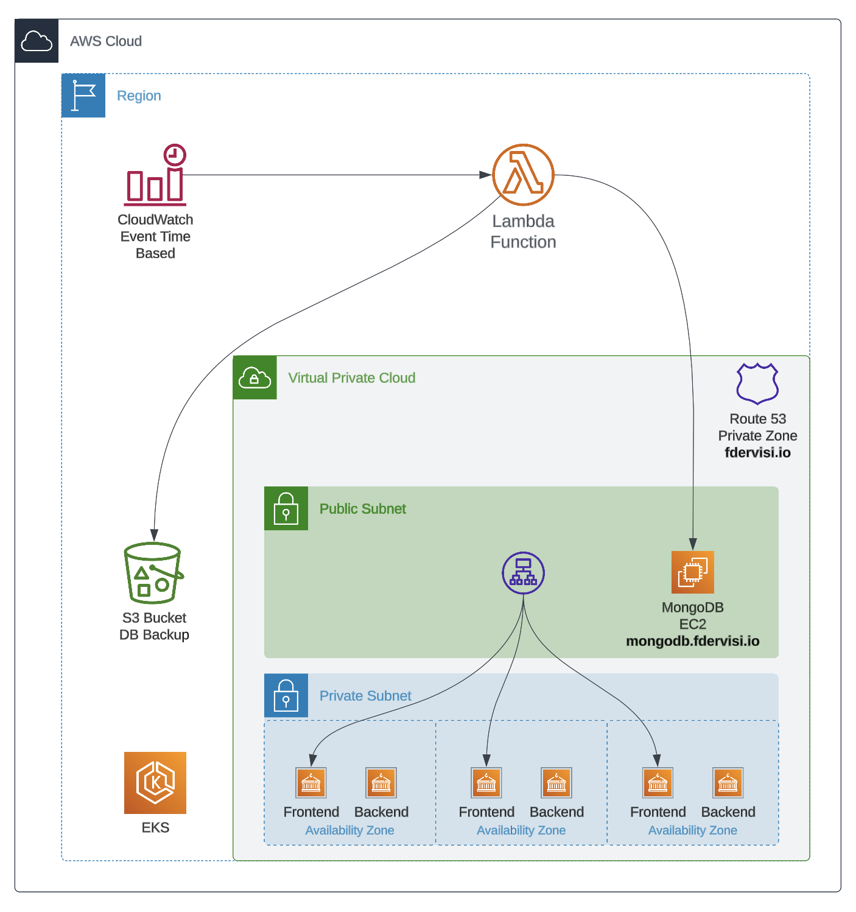
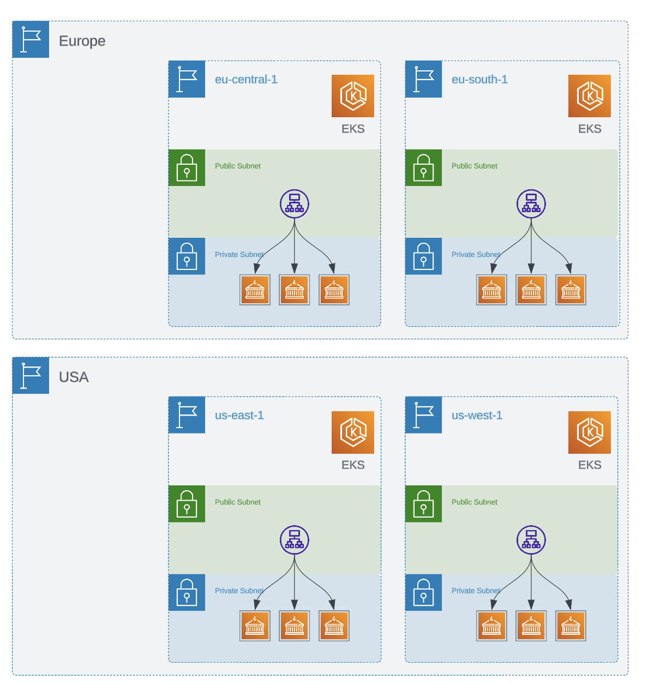
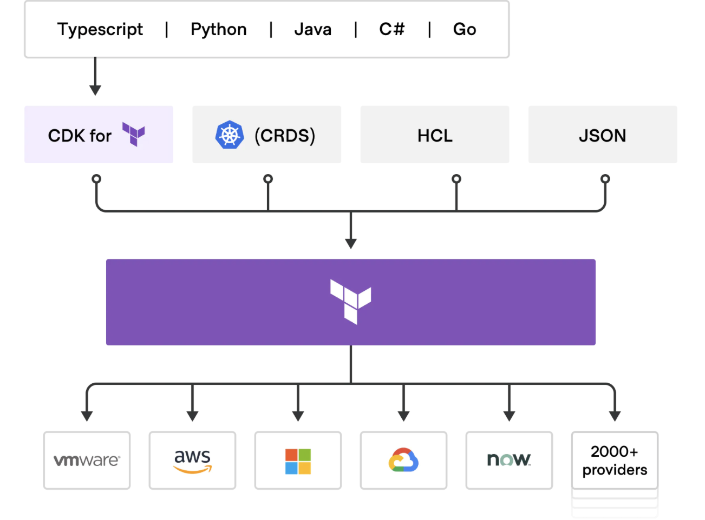

# Unleash the Power of CloudServiceTree for Advanced Cloud Management

This repository unveils the potential of CloudServiceTree, an innovative, no-code, and highly modular cloud infrastructure management framework developed by me. I have applied this framework to construct an advanced three-tier web application on Amazon Web Services (AWS) as a part of the Wiz SE Technical Exercise.

## Simplifying Cloud Management with CloudServiceTree

CloudServiceTree revolutionizes cloud infrastructure management by abstracting complex infrastructure code. This empowers you to define your cloud environment using simple, human-readable YAML configuration files. The focus of this exercise is a robust three-tier web application on AWS, employing various AWS services like IAM, S3, VPC, EKS, and EC2, with MongoDB deployed on an EC2 instance.



## Understanding CloudServiceTree Configuration

Below is the breakdown of the YAML configuration file that orchestrates our deployment of a feature-rich cloud environment on AWS:

```yaml
iamRole:
  mongoDbInstanceRole:
    - assumeRolePolicy: instance_assume_role_policy.json
      iamPolicyTemplateJson:
        - ec2_all.json        
userId: fdervisi
regions: 
  - name: eu-south-1
    lamdaS3Bucket: fdervisi-repro-bucket
    s3:
      bucketName: fdervisi-mongodb-backup
      blockPublicAccess: false
    vpc:
      - cidrBlock: 10.0.0.0/20
        name: vpc-eks-app
        privateHostedZone: fdervisi.io
        eks:
          clusterName: eks-cluster
          version: "1.26"
          KubernetesApplication: false
          nodeGroup:
            instanceTypes: t3.small
            scalingConfig:
              desiredSize: 3
              maxSize: 5
              minSize: 1
        subnets:
          - name: subnet-eks-private1
            public: false
            cidrBlock: 10.0.1.0/24  
            availabilityZone: 0
            eks: true
          - name: subnet-eks-private2
            public: false
            cidrBlock: 10.0.2.0/24
            availabilityZone: 1
            eks: true
          - name: subnet-eks-private3
            public: false
            cidrBlock: 10.0.3.0/24
            availabilityZone: 2
            eks: true
          - name: subnet-mongoDB
            public: true
            cidrBlock: 10.0.4.0/24
            availabilityZone: 0
            eks: false
            instance:
              - name: instance-mongoDb
                instanceType: t3.micro
                ami: ami-0a3a6d4d737db3bc1
                associatePublicIpAddress: true
                eip: true
                privatDnsHostName: mongodb
                iamInstanceProfile: mongoDbInstanceRole
                userData: userdata.sh
                keyName: Key_MBP_fdervisi
                securityGroup:
                  ingress:
                    - cidrBlocks:
                        - 0.0.0.0/0
                      fromPort: 22
                      toPort: 22
                      protocol: "TCP"
                    - cidrBlocks:
                        - 0.0.0.0/0
                      fromPort: 27017
                      toPort: 27017
                      protocol: "TCP"
                  egress:
                    - cidrBlocks:
                        - 0.0.0.0/0
                      fromPort: 0
                      toPort: 0
                      protocol: "-1"
                  tags:
                    Owner: fdervisi
            
```

Let's dive into the configuration:

1. **IAM Role**: The IAM role `mongoDbInstanceRole` is defined with policies from the `instance_assume_role_policy.json` and `ec2_all.json` files. This role is associated with our MongoDB EC2 instance for appropriate access rights.

2. **User ID**: The `userId` `fdervisi` is the associated user for this configuration.

3. **Regions**: The configuration specifies `eu-south-1` as the AWS region. The `lamdaS3Bucket` `fdervisi-repro-bucket` is dedicated for AWS Lambda function storage, while the `s3` field creates the `fdervisi-mongodb-backup` bucket for MongoDB backups. The `blockPublicAccess` set to `false` allows public read access to the bucket.

4. **VPC**: The `vpc` field outlines a VPC named `vpc-eks-app` with a CIDR block of `10.0.0.0/20` and a private DNS zone (`fdervisi.io`).

   - **EKS**: Within the VPC, an EKS cluster named `eks-cluster` is created. The node group configuration specifies `t3.small` instances with a scaling configuration of 1-5 instances, aiming for 3 instances at any given time.

   - **Subnets**: Four subnets are configured within the VPC: three private subnets for the EKS cluster (`subnet-eks-private1`, `subnet-eks-private2`, `subnet-eks-private3`) and a public subnet (`subnet-mongoDB`) for the MongoDB instance.

5. **MongoDB Instance**: An EC2 instance named `instance-mongoDb` is established in the `subnet-mongoDB` for MongoDB. This `t3.micro` instance uses the defined AMI and IAM role (`mongoDbInstanceRole`). The instance is publicly accessible and has an Elastic IP (EIP).

   - **Security Group**: The security group rules for this instance are specified under `ingress` and `egress`. Ingress rules permit SSH (port 22) and MongoDB (port 27017) connections from any IP (`0.0.0.0/0`). The egress rule allows all outbound traffic. The security group is tagged with `Owner: fdervisi`.

This YAML configuration simplifies the deployment and management of a containerized web application in an EKS cluster, backed by a MongoDB database on an EC2 instance within a well-structured VPC. Its modularity facilitates scaling and adjustment of individual components. If you want to scale this deployment into a true multi-region deployment, you just have to copy and paste the structure and adjust the parameters to match your desired region.



## Modularity and Extensibility

CloudServiceTree's modular design makes it easy to manage individual services, allowing for independent updating, scaling, or modifying without disrupting the entire infrastructure. Each YAML configuration file operates as an independent module, contributing to a specific part of the infrastructure, whether it's setting up an IAM role, defining a VPC, or deploying an EKS cluster. This flexibility facilitates infrastructure growth without requiring additional scripting or manual work.

## GUI Backend Support

CloudServiceTree's approach makes it a suitable backend for a graphical user interface (GUI). By simply interacting with the GUI, users can modify the Topology to alter the infrastructure without needing to write or understand code. This not only brings convenience to the users but also enhances efficiency, particularly when scaling or adjusting the cloud environment to meet evolving requirements.

# Advantages over Traditional Terraform Deployment

CloudServiceTree leverages the Cloud Development Kit for Terraform (CDKTF), which empowers you to use familiar programming languages for defining and provisioning your infrastructure. With this tool, you gain access to the extensive Terraform ecosystem without needing to master HashiCorp Configuration Language (HCL), and you can benefit from the strength of your existing toolchain for testing, dependency management, and more. We support TypeScript, Python, Java, C#, and Go.



After integrating your services into the CloudServiceTree framework, you'll be able to fully appreciate its benefits. Notably, this framework contrasts the traditional Terraform approach. Following the integration, the abstraction into a CloudServiceTree offers the following advantages:

CloudServiceTree introduces considerable improvements compared to traditional Terraform deployments:

1. **No-Code Deployment**: CloudServiceTree makes use of human-readable YAML configuration files, eliminating the need to understand and write in Terraform's HashiCorp Configuration Language (HCL).

2. **Modular Architecture**: CloudServiceTree's high-level, service-based modularity results in less code, a clearer structure, and enhanced maintainability. This presents a notable advantage over the module-based architecture in Terraform.

3. **Scalability**: Scaling across multiple regions or incorporating new services with CloudServiceTree is simplified to just adding or duplicating configuration modules. In contrast, Terraform requires writing additional code for such tasks.

4. **Integration with GUI**: The no-code approach and clean structure of CloudServiceTree make it an excellent candidate for integration with a graphical user interface (GUI) for infrastructure management. Achieving such integration is not as straightforward with Terraform.

In conclusion, CloudServiceTree offers a user-friendly, scalable, and efficient method for managing cloud infrastructure. The deployment of a robust three-tier web application showcased in this exercise underscores the remarkable advantages and the power of this next-generation approach to cloud management.


# Automating Web App Deployment with Helm

In this repository, Helm was used to automate the deployment of the web application. Helm is a package manager for Kubernetes that simplifies the process of managing and deploying applications. You can find more detailed documentation in the [eks-app-chart](./eks-app-char/) directory.


